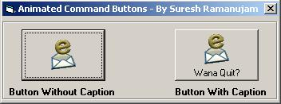



## Animated Command Buttons

### Description

This simple and easy code lets ya to animate your command buttons with or without caption. This does not use any other activex controls or API's.I had added the screenshot. do rate my code folks!!
 
### More Info
 

             |
---                |---
**Submitted On**   |2004-07-11 23:01:34
**By**             |[Suresh Ramanujam](https://github.com/Planet-Source-Code/PSCIndex/blob/master/ByAuthor/suresh-ramanujam.md)
**Level**          |Intermediate
**User Rating**    |4.2 (25 globes from 6 users)
**Compatibility**  |VB 5\.0, VB 6\.0
**Category**       |[Graphics](https://github.com/Planet-Source-Code/PSCIndex/blob/master/ByCategory/graphics__1-46.md)
**World**          |[Visual Basic](https://github.com/Planet-Source-Code/PSCIndex/blob/master/ByWorld/visual-basic.md)
**Archive File**   |[Animated\_C1775107282004\.zip](https://github.com/Planet-Source-Code/suresh-ramanujam-animated-command-buttons__1-55222/archive/master.zip)

